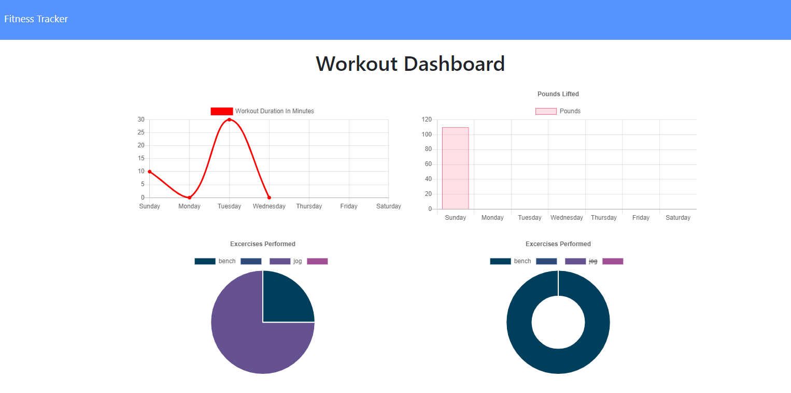
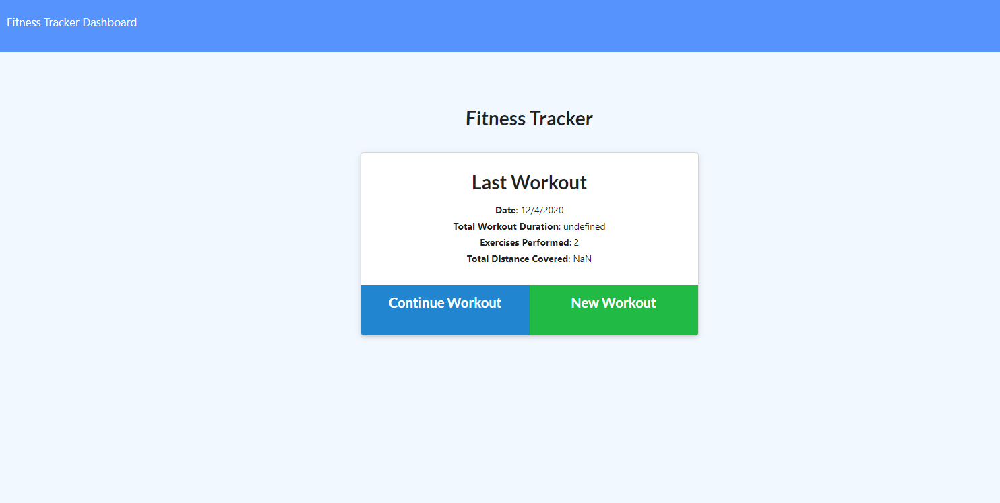

#  Workout Tracker 

## User Story

* As a user, I want to be able to view create and track daily workouts. I want to be able to log multiple exercises in a workout on a given day. I should also be able to track the name, type, weight, sets, reps, and duration of exercise. If the exercise is a cardio exercise, I should be able to track my distance traveled.

Description: The workout tracker app solves the real world problem of keeping track and charts of your favorite cardio and resistance workouts. The app integrates a Mongo database with a Mongoose schema and handle routes with Express  The  motivation to build this project was to help clients achieve their workout goals by having an accessible website that is easy to navigate.

Technologies used: HTML, CSS, JavaScript, MongoDB, Mongoose, Express, charts.js

Challenges:  Setting up MongoDB Atlas. I had to recreate my account because of password confusion. 

Future development: Have more options than just Resistance or Cardio. Create a React.js front-end. 

Installation: clone repo and  'npm install' and 'npm start'

Run: Using Chrome or a favorite browser copy link https://localhost:3000/ 

Deployed: https://desolate-castle-89952.herokuapp.com/ 

Authors and acknowledgment: Developed by Melanie Cisler
